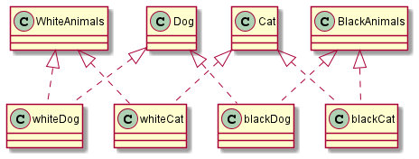

# Assignment

##  1. ให้นักศึกษา ทดลองใช้งาน PlantUML ##
ศึกษาขั้นตอนการใช้จากคลิป plantuml มี 3 ตอน

PlantUML เป็นซอฟต์แวร์ช่วยวาดภาพแผนผัง UML จากการเขียนภาษาบรรยายที่เข้าใจง่าย ข้อดีของโปรแกรมนี้คือสามารถปรับปรุงแผนผังได้ง่ายกว่าซอฟต์แวร์สร้างแผนผังแบบลากวาง 

PlantUML ทำงานได้สำเร็จโดยอาศัยความช่วยเหลือจากซอฟต์แวร์ที่ชื่อ Graph Visualization ซึ่งเป็นซอฟต์แวร์ render กราฟที่ทรงพลังตัวหนึ่ง 

ทั้ง PlantUML และ Graph Visualization เป็น Open source software สามารถเข้าถึงได้จากลิงค์ต่อไปนี้ 

### PlantUML ###
- Web site -- https://plantuml.com/ 
- Source code -- https://github.com/plantuml/plantuml 

### Graph Visualization ###
- Web site -- https://graphviz.org/ 
- Source code -- https://gitlab.com/graphviz/graphviz 

### ซีรี่ส์ PlantUML ### 
มีเนื้อหา 3 ตอน ประกอบด้วย 
- ตอนที่ 1 แนะนำ PlantUML https://youtu.be/Iwu3LMvIO6k 
- ตอนที่ 2 การใช้ PlantUML บน VSCode https://youtu.be/BNwNFfjtCmk 
- ตอนที่ 3 การใช้ PlantUML ร่วมกับ GraphViz แบบ offline https://youtu.be/m-_3J5BceKM

----
## 2. ให้นำโค้ดต่อไปนี้ไป render ให้เป็น class diagram ##
   a. ใช้โปรแกรม plantUML บนเว็บ
   b. ใช้ extension ใน VScode
   c. ใช้โปรแกรม PlantUML.jar ที่ดาวน์โหลดมาทำงานแบบ offline บนเครื่องของนักศึกษาเอง

### 2.1 Code ของตัวอย่างที่ 3 (สไลด์ที่ 19) ###

``` puml
@startuml 
class Dog{}
class Cat{}
class WhiteAnimals{}
class BlackAnimals{}

WhiteAnimals <|.. whiteCat
WhiteAnimals <|.. whiteDog
BlackAnimals <|.. blackCat
BlackAnimals <|.. blackDog
Cat <|.. whiteCat
Dog <|.. whiteDog
Cat <|.. blackCat
Dog <|.. blackDog
@enduml 
```

#### ตัวอย่างผลที่ได้จากการ render สไลด์ 19 ####

### 2.2 Code ของตัวอย่าง ปรับปรุงการทำ Classification ของหมาและแมว (สไลด์ที่ 20) ###

``` puml
@startuml 
class Dog{}
class Cat{}

Cat <|.. whiteCat
Dog <|.. whiteDog
Cat <|.. blackCat
Dog <|.. blackDog
@enduml 
```

#### ตัวอย่างผลที่ได้จากการ render สไลด์ 20 ####

#### หมายเหตุ การใช้ลูกศรสามเหลี่ยมที่มีหัวโปร่งใสคือการทำ Inheritance ####

``` puml
@startuml 
"Base class" <|-- "Derived class"
@enduml 
```

### 2.3 Classification ของ class คน (สไลด์ที่ 20) ###

``` puml
@startuml 
class Person{
    - Name
    # Lastname
    - Gender
    - Age
    + TellNameAndLastName()
    + TellGender()
    + TellAge()
}

object Somsree
object Somkuan
object Somjit
object Somsak

Person <|.. Somsree
Person <|.. Somkuan
Person <|.. Somjit
Person <|.. Somsak

@enduml 
```

#### หมายเหตุ การใช้ลูกศรสามเหลี่ยมที่มีหัวโปร่งใสและเส้นประคือการทำ Instantiation (สร้างวัตถุ) ####

``` puml
@startuml 
"Base class" <|.. "Derived class"
@enduml 
```
----

